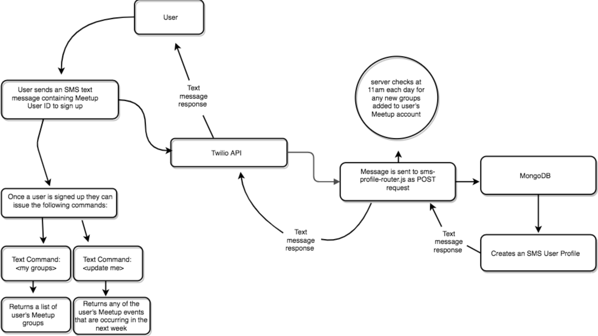

```
.___________..______       _______ .__   __.  _______   __      ____    ____ 
|           ||   _  \     |   ____||  \ |  | |       \ |  |     \   \  /   / 
`---|  |----`|  |_)  |    |  |__   |   \|  | |  .--.  ||  |      \   \/   /  
    |  |     |      /     |   __|  |  . `  | |  |  |  ||  |       \_    _/   
    |  |     |  |\  \----.|  |____ |  |\   | |  '--'  ||  `----.    |  |     
    |__|     | _| `._____||_______||__| \__| |_______/ |_______|    |__|     
                                                                             
```                              


## Code Fellows: Seattle 401 JavaScript - 401d19

### Authors:
 Cameron Moorehead, Catherine Looper, Dalton Carr, Matt LeBlanc

---
### Motivation

Trendly is a RESTful API that connects users via (Short Message Service) SMS to Meetup (`https://www.meetup.com/`). This app allows users to sign up with their Meetup User ID via text message. Once signed up, users will automatically receive a text notification 24 hours before any of their upcoming meetup events. With the Trendly application,  users no longer need to worry about missing a Meetup event as text notifications will keep users up to date on all of their Meetup groups.  

Trendly is built with a (Hypertext Transfer Protocol) HTTP server and basic and bearer authentication using Express. This server handles POST and GET requests/responses. This API uses MongoDB and Mongoose to write data to a db directory for persistence. This app is using Travis CI for continuous integration, and Heroku for deployment.

---

### How to use?

#### To sign up for Twilio Meetup SMS notifications:

* Send a text message to `+1 (206) 565-1148` with your Meetup User ID in the following format: `123456789`
* If you do not know your Meetup User ID, you can find it by visiting: https://www.meetup.com/account/

#### To use the Twilio Meetup SMS interface, you can issue the following commands:

* Send a text message to `+1 (206) 565-1148` with the command: `'my groups'` to see a list of your Meetup groups.
* Send a text message to `+1 (206) 565-1148` with the command: `'update me'` to be notified of any events that your Meetup groups are having during the next week.
* Send a text message to `+1 (206) 565-1148` with the command: `'stop'` to opt out of text notifications.

---
### Developer Tools:

* Step 1. Fork and Clone the Repository.
* Step 2. `npm install`.
* Step 3. touch a .env file and add the following environment variables:
```  
  PORT=3000
  MONGODB_URI=mongodb://localhost/testing
  CLOUD_SALT='AddYourOwnSecretKey'
  API_KEY=AddYourOwnMeetupAPIKey
  TWILIO_ACCOUNT_SID=AddYourOwnTwilioAccountSecretID
  TWILIO_AUTH_TOKEN=AddYourOwnTwilioAuthToken
  TWILIO_NUMBER=AddYourOwnTwilioNumber
``` 
* Step 4. start MongoDB by calling `npm run dbon`.
* Step 5. to test the API, open a second terminal window and run the command `npm run test`.
* Step 6. If you would like to start the server, you can run the command `npm run start`.

### If you would like to contribute:

* PR: If you would like to contribute to the Repo, please open a Pull Request and we will review it
* Bug Reporting: If you find a bug - please report it by opening up an issue in this git repository.

---
### Build



#### `Staging` : [](https://travis-ci.org/Meetup-Trendly/trendly-server)

#### `Master` : [](https://travis-ci.org/Meetup-Trendly/trendly-server)

---
#### Server Module

The server module is creating an http server, defining server-on behavior and exporting an interface for starting and stopping the server. The server module exports an object containing start and stop methods.

The server module requires in express, mongoose, logger, fs-extra, dotenv, logger-middleware, error-middleware, account-router.js, profile-router.js and the sms-profile-router.js file. The server.start and stop methods return a new Promise with resolve and reject parameters. The start method contains an app.listen function that listens for the server start. The server.stop method has an httpServer.close function that turns the server off by setting the isServerOn variable to false.

##### Scheduler Module

The `scheduler.js` file requires in node-schedule, the sms-profile model, superagent, the sms.js file, and the winston logger file. Inside of this module. There is a method called `runEventsNextDay()` which sends out an sms notification at noon, if the user has any events coming up within the next 24 hours. The file also contains a method called `runUpdateAllGroups()` which checks the meetup api everyday at 9am for updates on every user's meetup groups, if a user has joined a new meetup group recently it will be added to the notification list.

##### SMS Module
The `sms.js` file requires in the twilio accountSID and authToken environment variables, as well as twilio. This module contains a method called `sendMessage()` which accepts a specified message and phoneNumber and creates the message we want to send back to the user.

#### Route Module

##### `account-router.js`

`account-router.js` requires in the Router object from express, the jsonParser(body-parser), http-errors, the account.js model, and basic-auth-middleware.js. Inside the module, there is a function declared for `accountRouter.get` with the route `/login`. There is a function declared for `authRouter.post` with the route `/signup`. If a username, email, or password are not provided, then the user will receive a 400 error notifying them that those pieces of information are required. Otherwise, if all pieces of information are provided - then the method `createToken()` is called to send a response with the token. If all information is provided, then the `Account.create()` method is called and will create an account with a username, email and password.

##### `profile-router.js`

`profile-router.js` requires in the Router object from express, the jsonParser(body-parser), http-errors, the profile.js model, superagent, and bearer-auth-middleware.js. Inside the module, there is a function declared for `profileRouter.post` with the route `/profiles` and a `profileRouter.get` method with the route `/profiles/:id`. These routes handle posting a profile and retrieving a profile based on its id.

##### `sms-profile-router.js`

`sms-profile-router.js` requires in the Router object from express, body-parser, http-errors, superagent, the logger.js file, twilio, the sms model and the sms-profile model. Inside the module, there is a function declared for `smsProfileRouter.post` with the route `/sms-profile`. This method handles the Twilio SMS correspondence between users and the Twilio API.


#### Model Module

##### `account.js`

`account.js` requires in mongoose, crypto (which generates random strings), bcrypt (for hash passwords), http-errors, and jsonwebtoken. The account model includes the parameters: passwordHash, email, username, tokenSeed, and dateCreated. The account model has the methods: `accountSchema.methods.verifyPassword()` and `accountSchema.methods.createToken()` which are for authentication and token creation. There is also an `Account.create()` method with the parameters: username, email, and password that actually creates the account.

##### `profile.js`

`profile.js` requires in mongoose. The profile model includes the parameters: meetupMemberId, name, phoneNumber, account, and meetups. The profileSchema is being exported from the file. This model has a one to one relationship with the account.js model.


##### `sms-profile.js`

`sms-profile.js` requires in mongoose. The sms profile model includes the parameters: meetupMemberId, meetupMemberName, phoneNumber, and meetups. The smsProfileSchema is being exported from the file. 


#### Test Module

Contains a `lib/` directory with the files: `setup.js`,   `account-mock-factory.js`, and  `profile-mock-factory.js`. These files assist in the tests by setting up the environment variables and mock objects to test.

* `POST` - tests for status codes: 
  * `200` - successful post request
  * `400` - if an incomplete post request is sent
  * `401`/`404 ` - if unauthorized request
  * `409` - if keys are unique

* `GET` - tests for status codes:
  * `200` - successful post request
  * `400` - if an incomplete post request is sent
  * `401`/`404 ` - if unauthorized request
  * `409` - if keys are unique


#### Middleware

#####  `basic-auth-middleware.js`

The basic auth middleware sets up the authentication for username/password verification.

##### `bearer-auth-middleware.js`

The bearer auth middleware handles the error checking for the authorization. It checks that the token is authorized.

##### `error-middleware.js`

The error-middleware module handles error messages for a variety of different use cases, including HTTP errors and MONGODB errors. 

* HTTP errors include the following logs: 

 ``` 
  log('info','__ERROR_MIDDLEWARE__');
  log('info',error);

  if(error.status){
    log('info',Responding with a ${error.status} status and message: ${error.message});
    return response.sendStatus(error.status);
  }
  ```
* MONGODB errors include the following logs:

```
  if(message.includes('validation failed')) {
    log('info','Responding with a 400 status code');
    return response.sendStatus(400);
  }

  if(message.includes('duplicate key')) {
    log('info','Responding with a 409 status code');
    return response.sendStatus(409);
  }

  if(message.includes('objectid failed')) {
    log('info','Responding with a 404 status code');
    return response.sendStatus(404);
  }

  if(message.includes('unauthorized')) {
    log('info','Responding with a 401 status code');
    return response.sendStatus(401);
  }
```

* If there is an error that doesn't match the above, then:

```
  log('info', 'Responding with a 500 status code');
  log('info', error);
  return response.sendStatus(500);
```

##### `logger-middleware.js`

The logger-middleware module logs the request method processes and request urls and returns next to continue on in the promise chain.

---
### Limitations

This app is developed with a backend only - future versions of this app will include a user interface with signup/login capabilities.

---

### Code Style

Standard JavaScript with ES6

---

### Tech/Framework used

* JavaScript / ES6
* Node.js
* Jest
* Eslint
* Superagent
* Mongoose
* Winston
* Express
* Dotenv
* Body-Parser
* http-errors
* bcrypt
* crypto
* jsonwebtoken
* fs-extra
* multer
* node-schedule

---

### Credits

* Code Fellows
* Heroku - for deployment
* Meetup - for api reference
* Travis.ci - for continuous integration
* MongoDB - for persistence
* Twilio - for sms interface

---

### License

MIT © Trendly